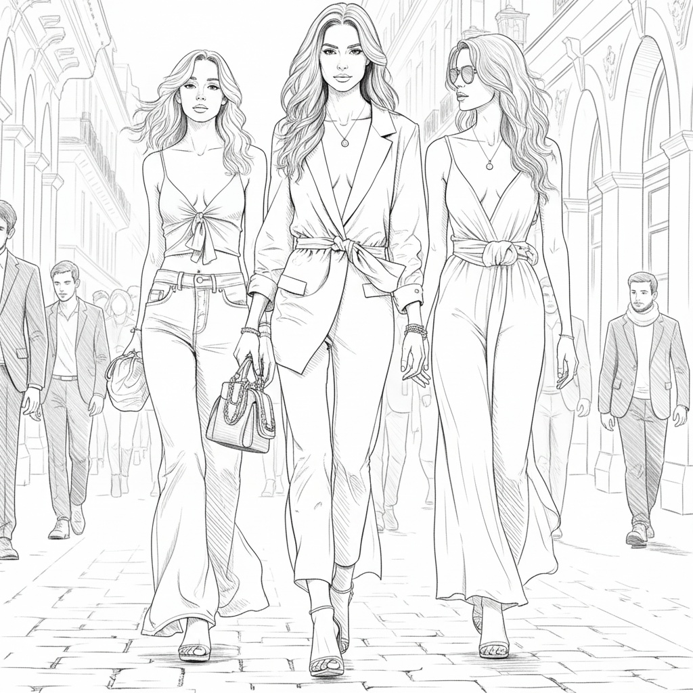

# 🎨 GenLineArt: Photo to Anime/Manga Line Art Generator

> **Turn real-world photos into high-quality anime/manga backgrounds and line art in seconds.** > Perfect for Manga artists, Game developers, and Stable Diffusion ControlNet workflows.

---

## What is GenLineArt?

**[GenLineArt.com](https://genlineart.com)** is an AI-powered tool designed to extract clean, aesthetic line art from photographs. 

Unlike traditional edge detection algorithms (like Canny, Sobel, or HED) which often produce messy, noisy, or "too realistic" lines, **GenLineArt** focuses on the **Anime/Manga aesthetic**. It simplifies complex details and emphasizes structural lines, making it production-ready for creative projects.

### Try it Online: [www.genlineart.com](https://genlineart.com)

---

## Gallery & Examples

|                        Original Photo                        |               GenLineArt Result                |
| :----------------------------------------------------------: | :--------------------------------------------: |
|  |  |
|                       *Personal photo*                       |              *Clean backgrounds*               |
|                |      |

*(Note: Click the images to see high-res versions on the website)*

---

## Key Features

* **Anime Aesthetic:** specifically trained to mimic the line weight and simplification style of Japanese manga backgrounds.
* **Noise Free:** Automatically removes unnecessary textures (like asphalt noise or messy foliage) that ruin traditional line extraction.
* **Lightning Fast:** Get results in seconds via the web interface.
* **ControlNet Ready:** The output is perfect for Stable Diffusion ControlNet (Lineart/Canny models) to recolor or restyle images.

---

## Use Cases

### 1. For Manga/Comic Creators

Stop drawing backgrounds from scratch. Take a photo of a street, classroom, or building, run it through [GenLineArt](https://genlineart.com), and you have a 90% finished background.

### 2. For Game Developers (Visual Novels)

Create consistent background assets for your Ren'Py or Unity visual novels quickly.

### 3. For AI Artists (Stable Diffusion)

Use our generated line art as a superior input for **ControlNet**.

* **Step 1:** Upload photo to [GenLineArt](https://genlineart.com).
* **Step 2:** Download the clean line art.
* **Step 3:** Use it in ControlNet to guide your generation, ensuring perfect composition.

---

## Quick Start

You don't need to install heavy Python dependencies or buy a GPU. We run the heavy lifting on our cloud.

1.  Go to **[GenLineArt.com](https://genlineart.com)**.
2.  Upload your image (Supports JPG, PNG).
3.  Choose your style or write your prompt, then click **Generate**.
4.  Download your HD Line Art.

---

## Feedback & Support

We are constantly improving our line extraction algorithm.
If you have any feedback or feature requests, feel free to open an issue in this repo or contact us through the website.

**[Start Creating Now ->](https://genlineart.com)**

contact：support@genlineart.com

